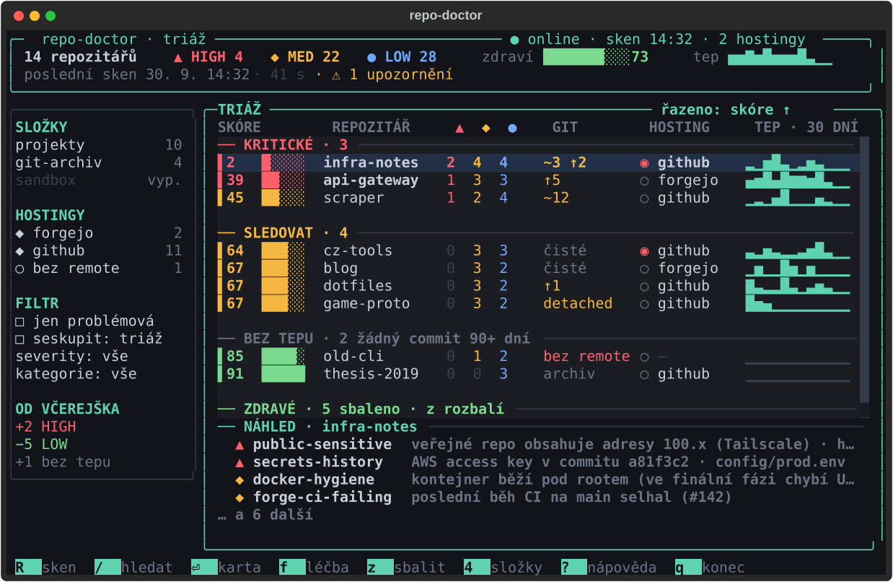

# repo-doctor

TUI pro audit a údržbu git repozitářů. Projde jednu nebo víc tvých složek s repozitáři,
volitelně se připojí k jejich git hostingům (GitHub, Gitea, Forgejo, GitLab), najde
bezpečnostní a hygienické problémy, vyrobí přehledný report a umí **bezpečně** připravit
opravy – vždy jako commity v nové větvi, kterou si zkontroluješ sám.



- **Triáž místo seznamu:** repozitáře roztříděné do pásem KRITICKÉ / SLEDOVAT / BEZ TEPU / ZDRAVÉ,
  skóre 0–100, tep (commity za 30 dní), stav gitu a viditelnost na hostingu.
- **Karta repa** s diagnózou každého nálezu, vysvětlením a ručním postupem opravy.
- **Léčba:** barevný diff navrhovaných oprav, výběr zaškrtávátky a potvrzení dialogem.
- **Funguje úplně offline** a bez hostingů; síťové kontroly (OSV.dev, PyPI, npm, API hostingů) jsou nadstavba.
- **Minimální CLI** pro CI (`repo-doctor scan --report md|json|html`).

## Instalace

Potřebuješ Python 3.12+ a `git`. Volitelně `gitleaks` (rychlejší sken tajemství),
`wl-clipboard` (kopírování cesty) a `xdg-utils` (otevření repa na webu).

```sh
uv tool install git+https://github.com/Luquas95/repo-doctor
# nebo
pipx install git+https://github.com/Luquas95/repo-doctor
```

Arch Linux: PKGBUILD je v [`packaging/aur/`](packaging/aur/PKGBUILD) (`makepkg -si`).

## Rychlý start

```sh
repo-doctor                 # TUI nad složkami z konfigurace
repo-doctor ~/projekty      # jednorázově jiné složky (nic se neukládá)
```

Při prvním spuštění (bez konfigurace) se otevře **průvodce**: zadáš složky s repozitáři
(Tab doplňuje cestu, Enter přidá), průvodce navrhne hloubku prohledávání podle nalezených
repozitářů a volitelně přidáš git hosting. `Ctrl+S` uloží konfiguraci a spustí první sken.
TUI se pak vždy otevře okamžitě s výsledky posledního skenu a nový sken běží na pozadí.

## Nastavení složek

Obrazovka **Složky** (`4`): `n` přidat (s našeptáváním a kontrolou, že cesta existuje),
`e` upravit hloubku a vylučující vzory, `space` dočasně vypnout, `d` odebrat. U každé složky
vidíš počet nalezených repozitářů. Discovery:

- prochází složku do nastavené hloubky, přeskakuje `node_modules`, `.venv`, `target`, `dist` apod.,
- nevstupuje do vnořených repozitářů (submoduly patří k rodiči),
- symlinky nenásleduje, pokud to složka nepovolí (`follow_symlinks = true`),
- stejné repo dosažitelné dvěma cestami započítá jednou (podle `realpath`).

## Připojení hostingů

Obrazovka **Hostingy** (`5`): `n` přidat, `T` otestovat připojení (ověří token a ukáže,
kolik repozitářů účet vidí), `d` odebrat. Token se v UI nikdy nezobrazí a **nikdy se
neukládá do `config.toml`** – zdroj tokenu je jeden z:

| zdroj | konfigurace |
|---|---|
| systémová klíčenka (Secret Service, výchozí v průvodci) | `token_source = "keyring"` |
| proměnná prostředí | `token_env = "FORGEJO_TOKEN"` |
| příkaz (výstup se ořízne a nikam neloguje) | `token_cmd = "pass show git/forgejo"` |

repo-doctor na hostingu **nic nemění** – stačí tokeny jen pro čtení. Minimální oprávnění:

| hosting | minimální token |
|---|---|
| GitHub | fine-grained token, read-only: *Metadata*, *Contents*, *Actions*, *Dependabot alerts*, *Secret scanning alerts* (klasický token: `public_repo`/`repo` je zbytečně široký – `forges test` upozorní) |
| Gitea / Forgejo | scopes `read:repository`, `read:user`, `read:issue` |
| GitLab | `read_api` (+ `read_repository` pro HTTPS klon) |

### Self-hosted Forgejo za Tailscale

```toml
[[forges]]
name = "domaci-forgejo"
type = "forgejo"
url = "https://git.tailnet-name.ts.net:3000"   # nebo https://100.x.y.z:3000
user = "ja"
token_cmd = "pass show git/forgejo"
ca_bundle = "~/.local/share/certs/homelab-ca.pem"  # pro self-signed certifikát
clone_protocol = "ssh"
```

Remote typu `ssh://git@git.tailnet-name.ts.net:2222/ja/repo.git` se k hostingu přiřadí podle
hostname (SSH port se může lišit od webového). Fungují i aliasy z `~/.ssh/config`
(`Host forgejo` + `HostName …`). SSH příkaz se bere z proměnné `GIT_SSH_COMMAND`, jinak
z globálního či systémového `core.sshCommand` (i ze souborů vložených přes `[include]`);
nastavení z `includeIf` podle složky repo-doctor nepoužije, takové nastavení je potřeba dát
do proměnné `GIT_SSH_COMMAND` nebo do `~/.ssh/config`. `verify_tls = false` jde nastavit, ale UI před tím varuje –
raději použij `ca_bundle`. Výpadek hostingu (Tailscale vypnutý) nic neblokuje: kontroly
hostingu se označí jako „nedostupné“.

Obrazovka **Vzdálená repa** (`6`) ukáže repozitáře na hostinzích, které nemají lokální klon
(`c` naklonuje po potvrzení do vybrané složky, existující složku nikdy nepřepíše), a opačně
lokální repa bez remote nebo s remote, které hosting nezná.

## Klávesové zkratky

Ovládání jako lazygit / k9s – vše jde jen z klávesnice, myš je volitelná. `?` zobrazí
nápovědu generovanou ze stejných definic, `Ctrl+P` příkazovou paletu (všechny akce
a přechod na libovolné repo podle názvu). Zkratky jdou přemapovat v `config.toml`:

```toml
[keys]
scan_all = "F5"
detail_fix = "ctrl+f"
```

Neplatné nebo kolidující mapování se při startu nahlásí srozumitelnou chybou
(`repo-doctor config validate` ho ověří předem).

**Globální**

| Klávesa | Akce |
|---|---|
| `?` | nápověda |
| `ctrl+p` | příkazová paleta |
| `1` | přehled |
| `2` | karta repa |
| `3` | léčba |
| `4` | složky |
| `5` | hostingy |
| `6` | vzdálená repa |
| `7` | nastavení |
| `8` | export |
| `/` | hledat |
| `R` | sken |
| `r` | sken repa |
| `F` | sken s git fetch |
| `x` | zrušit sken |
| `O` | offline režim |
| `t` | světlé / tmavé téma |
| `q` | zpět / konec |
| `ctrl+c` | okamžitý konec |

**Pohyb**

| Klávesa | Akce |
|---|---|
| `j` | dolů |
| `k` | nahoru |
| `g` | začátek seznamu |
| `G` | konec seznamu |
| `ctrl+d` | půl stránky dolů |
| `ctrl+u` | půl stránky nahoru |
| `tab` | další panel |
| `shift+tab` | předchozí panel |

**Přehled (triáž)**

| Klávesa | Akce |
|---|---|
| `⏎` | karta |
| `f` | léčba |
| `z` | sbalit |
| `S` | řadit podle sloupce |
| `s` | obrátit řazení |
| `alt+1` | filtr ▲ HIGH |
| `alt+2` | filtr ◆ MED |
| `alt+3` | filtr ● LOW |
| `p` | jen problémová repa |
| `alt+g` | seskupit: triáž / složka / hosting |
| `b` | levý panel |

**Karta repa**

| Klávesa | Akce |
|---|---|
| `f` | léčba |
| `a` | allowlist |
| `o` | editor |
| `w` | web |
| `y` | kopírovat cestu |

**Léčba**

| Klávesa | Akce |
|---|---|
| `space` | vybrat |
| `A` | vše |
| `⏎` | potvrdit |

**Složky**

| Klávesa | Akce |
|---|---|
| `n` | přidat |
| `e` | upravit |
| `d` | odebrat |
| `space` | zapnout / vypnout |

**Hostingy**

| Klávesa | Akce |
|---|---|
| `n` | přidat |
| `e` | upravit |
| `d` | odebrat |
| `T` | otestovat připojení |

**Vzdálená repa**

| Klávesa | Akce |
|---|---|
| `c` | naklonovat |
| `v` | přepnout pohled |
| `ctrl+r` | načíst znovu |

**Nastavení**

| Klávesa | Akce |
|---|---|
| `d` | odebrat z allowlistu |

**Export**

| Klávesa | Akce |
|---|---|
| `e` | exportovat |

**Průvodce prvním spuštěním**

| Klávesa | Akce |
|---|---|
| `ctrl+s` | uložit a skenovat |
| `ctrl+n` | přidat hosting |

**Formulářové dialogy**

| Klávesa | Akce |
|---|---|
| `ctrl+s` | uložit / potvrdit formulář |

## Kontroly

| ID | Kategorie | Severity | Automatická oprava | Síť / hosting |
|---|---|---|---|---|
| [`deps-lockfile-missing`](docs/checks/deps-lockfile-missing.md) | Bezpečnost | MED |  |  |
| [`deps-vulnerable`](docs/checks/deps-vulnerable.md) | Bezpečnost | HIGH |  | síť |
| [`docker-hygiene`](docs/checks/docker-hygiene.md) | Bezpečnost | MED | ✓ |  |
| [`env-committed`](docs/checks/env-committed.md) | Bezpečnost | HIGH | ✓ |  |
| [`public-sensitive`](docs/checks/public-sensitive.md) | Bezpečnost | HIGH |  | síť |
| [`secrets-history`](docs/checks/secrets-history.md) | Bezpečnost | HIGH |  |  |
| [`secrets-tree`](docs/checks/secrets-tree.md) | Bezpečnost | HIGH |  |  |
| [`ci-missing`](docs/checks/ci-missing.md) | Údržba | LOW | ✓ |  |
| [`deps-outdated`](docs/checks/deps-outdated.md) | Údržba | LOW |  | síť |
| [`gitignore-incomplete`](docs/checks/gitignore-incomplete.md) | Údržba | MED | ✓ |  |
| [`gitignore-missing`](docs/checks/gitignore-missing.md) | Údržba | MED | ✓ |  |
| [`large-files`](docs/checks/large-files.md) | Údržba | MED |  |  |
| [`license-missing`](docs/checks/license-missing.md) | Údržba | LOW | ✓ |  |
| [`precommit-missing`](docs/checks/precommit-missing.md) | Údržba | LOW | ✓ |  |
| [`readme-missing`](docs/checks/readme-missing.md) | Údržba | LOW | ✓ |  |
| [`scan-incomplete`](docs/checks/scan-incomplete.md) | Údržba | LOW |  |  |
| [`default-branch-behind`](docs/checks/default-branch-behind.md) | Stav gitu | LOW |  |  |
| [`detached-head`](docs/checks/detached-head.md) | Stav gitu | LOW |  |  |
| [`no-remote`](docs/checks/no-remote.md) | Stav gitu | MED |  |  |
| [`stale-branches`](docs/checks/stale-branches.md) | Stav gitu | LOW |  |  |
| [`stashes`](docs/checks/stashes.md) | Stav gitu | LOW |  |  |
| [`uncommitted`](docs/checks/uncommitted.md) | Stav gitu | LOW |  |  |
| [`unpushed`](docs/checks/unpushed.md) | Stav gitu | MED |  |  |
| [`unsafe-ownership`](docs/checks/unsafe-ownership.md) | Stav gitu | LOW |  |  |
| [`forge-archived-active`](docs/checks/forge-archived-active.md) | Hosting | MED |  | hosting |
| [`forge-ci-failing`](docs/checks/forge-ci-failing.md) | Hosting | MED |  | hosting |
| [`forge-mirror-drift`](docs/checks/forge-mirror-drift.md) | Hosting | LOW |  | hosting |
| [`forge-no-branch-protection`](docs/checks/forge-no-branch-protection.md) | Hosting | LOW |  | hosting |
| [`forge-security-alerts`](docs/checks/forge-security-alerts.md) | Hosting | HIGH |  | hosting |
| [`forge-stale-prs`](docs/checks/forge-stale-prs.md) | Hosting | LOW |  | hosting |
| [`forge-unknown-remote`](docs/checks/forge-unknown-remote.md) | Hosting | MED |  | hosting |
Podrobnosti ke každé kontrole: `repo-doctor explain <id>` nebo [`docs/checks/`](docs/checks/).

## Konfigurace

`$XDG_CONFIG_HOME/repo-doctor/config.toml` (fallback `~/.config`). Cache je v
`$XDG_CACHE_HOME/repo-doctor/` (poslední sken, odpovědi API), historie skenů v
`$XDG_DATA_HOME/repo-doctor/history/`. Všechno, co nastavíš v TUI, se zapisuje sem a ruční
úpravy (včetně komentářů) zůstávají zachované.

```toml
[[roots]]
path = "~/projekty"
depth = 3
exclude = ["**/archiv/**"]
enabled = true
follow_symlinks = false

[[forges]]
name = "github"
type = "github"
user = "nekdo"
token_source = "keyring"

[checks]
disabled = ["deps-outdated"]
fail_on = "high"          # práh exit kódu CLI

[limits]
large_file_mb = 5
stale_branch_days = 90
stash_days = 30
no_pulse_days = 90        # pásmo BEZ TEPU
stale_pr_days = 30
history_timeout_s = 60    # pak nález scan-incomplete
history_size = 30

[[allowlist]]
hash = "0123456789abcdef" # otisk nálezu (a v kartě repa ho přidá)
reason = "testovací fixtura"

ignore_paths = ["vendor/**"]
ignore_repos = ["*-fork"]
license = "MIT"           # MIT | ISC | BSD-2-Clause | Unlicense
templates_dir = "~/.config/repo-doctor/templates"
ssh_batch_mode = true     # false = nepřidávat `-o BatchMode=yes` (vlastní SSH wrapper)

[ui]
theme = "dark"            # dark | light (t přepne)
editor = "nvim"
```

`.repo-doctor.toml` v kořeni repozitáře přepisuje `checks`, `limits`, `allowlist`,
`ignore_paths` a `license` pro dané repo.

## Bezpečnostní záruky – co repo-doctor nikdy neudělá

- **Ve výchozím stavu jen čte.** Změny dělá jen po výslovném potvrzení opravy v TUI.
- **Nikdy nepushuje, nepřepisuje historii, nemaže branche ani stashe a nesahá na necommitnuté
  změny.** Opravy vznikají jako commity v nové větvi `repo-doctor/fixes-<datum>` postavené
  v dočasném indexu – pracovní strom, index i aktuální větev zůstanou beze změny. Repo
  s necommitnutými změnami oprava odmítne.
- **Na hostingu nic nemění** – API se jen čte. Jedinou výjimkou je klonování na disk po potvrzení.
- **Tajemství nikdy nevypíše** – v TUI, reportech, logech ani JSON je vidět jen maskovaná podoba
  `AKIA…(20 znaků)`. Totéž platí pro tokeny hostingů. Odmaskovat nejde; soubor otevřeš klávesou `o`.
- CLI repozitáře nikdy nemění (jen `--fetch` aktualizuje remote-tracking refy, a to jen na požádání).
- Git v cizích repech nespouští programy z jejich konfigurace (fsmonitor, externí diff, textconv).

## Použití v CI

```sh
repo-doctor scan [PATH…] --report md|json|html [--output FILE] [--offline] [--no-forges] \
    [--only/--skip CHECKS] [--jobs N] [--fail-on high|medium|low] [--fetch]
repo-doctor explain CHECK_ID
repo-doctor checks
repo-doctor forges test [NAME]      # token nikdy nevypíše
repo-doctor config path|validate
```

Exit kódy: `0` = bez nálezů nad prahem, `1` = nálezy nad prahem, `2` = chyba. Bez TTY
`repo-doctor` bez argumentů nespouští TUI, ale vypíše nápovědu. JSON report má verzované
schéma (`schema_version`, [`docs/report-schema.json`](docs/report-schema.json)).

```yaml
- run: uvx --from git+https://github.com/Luquas95/repo-doctor repo-doctor scan . --offline --fail-on high
```

## Vývoj

Viz [CLAUDE.md](CLAUDE.md) (spuštění, testy, přidání kontroly) a
[docs/DECISIONS.md](docs/DECISIONS.md). Licence MIT.
