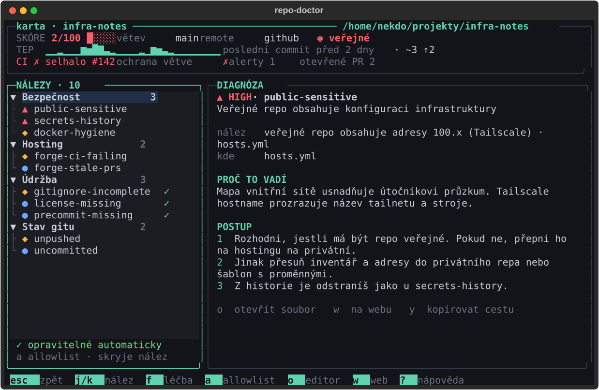
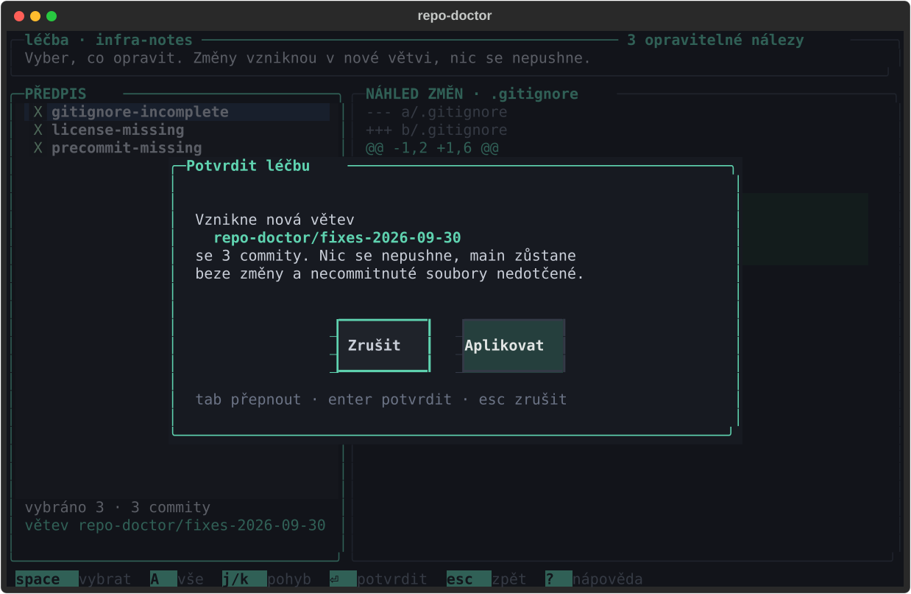

# Návrh TUI – koncept „Triáž“

Závazný vizuální směr (ne pixel-perfect). Snapshot testy v `tests/test_snapshots.py`
vykreslují stejné obrazovky (Přehled, Karta repa, Léčba s potvrzovacím dialogem) ve
velikostech 80×24 a 160×48, tmavě i světle, a navíc ve velikosti wireframů 100×31.
Výsledné screenshoty jsou v [`docs/screenshots/`](../screenshots/).

| Obrazovka | Screenshot (100×31) |
|---|---|
| Přehled / Triáž |  |
| Karta repa (Diagnóza) |  |
| Léčba s potvrzením |  |

Odchylky od wireframů jsou popsané v [DECISIONS.md](../DECISIONS.md) (např. spodní lišta
vypouští na úzkém terminálu méně důležité klávesy, `?` a `q` zůstávají vždy).

## Vizuální koncept „Triáž“ (závazný směr, ne pixel-perfect)

Aplikace nemá vypadat jako další obecná tabulka. Koncept stojí na lékařské metafoře, použité střídmě a vždy srozumitelně:

- **Triáž místo seznamu:** přehled třídí repozitáře do pásem **KRITICKÉ** (skóre < 40 nebo jakýkoli HIGH), **SLEDOVAT** (< 70), **BEZ TEPU** (žádný commit 90+ dní, konfigurovatelné) a **ZDRAVÉ**. Pásma jdou sbalit (`z`); ZDRAVÉ je ve výchozím stavu sbalené.
- **Tep:** sparkline počtu commitů za den za posledních 30 dní (`▁▂▃▄▅▆▇█`). Mrtvé repo má plochou čáru. V hlavičce je souhrnný tep všech repozitářů.
- **Karta** = detail repa, **Diagnóza** = detail nálezu, **Léčba** = obrazovka oprav, **Předpis** = vybrané opravy.
- **Vitální funkce v hlavičce:** počet repozitářů, počty podle severity, celkové zdraví (průměrné skóre) a tep. Při skenu se pod nimi zobrazí průběh a právě běžící kontrola.
- **Od včerejška:** levý panel ukazuje změnu oproti předchozímu skenu (+2 HIGH, −5 LOW). Ukládej proto historii skenů (posledních N, výchozí 30) do `$XDG_DATA_HOME/repo-doctor/history/`.
- **Náhled** dole na přehledu ukazuje hlavní nálezy vybraného repa, takže není nutné otevírat kartu.

Vizuální pravidla:
- Každý řádek repa začíná barevným proužkem `▌` a měřičem skóre z 5 bloků. Barva podle skóre: < 40 červená, < 70 jantarová, jinak zelená.
- Severity vždy jako symbol + barva: `▲` HIGH, `◆` MED, `●` LOW. Nula je potlačená (tmavě šedá).
- Viditelnost: `◉` veřejné (červeně), `○` privátní.
- Git stav zkratkami: `~3` necommitnuté soubory, `↑2` nepushnuté commity, `detached`, `bez remote`.
- Zaoblené rámečky, nadpisy panelů v akcentní barvě, doplňkové info v rámečku vpravo (`řazeno: skóre ↑`).
- Spodní lišta zkratek jako „klávesové čepičky“ (klávesa na akcentním pozadí + popisek).
- Potvrzovací dialog je modální, s akcentním rámečkem; výchozí tlačítko je **Zrušit**.

Paleta (tmavé téma, jako Textual theme; světlé téma odvoď se stejným kontrastem, WCAG AA):

| role | barva | role | barva |
|---|---|---|---|
| pozadí | `#12141a` | panel | `#171a21` |
| výběr řádku | `#223047` | text | `#c9ced8` |
| tlumený text | `#6b7385` | potlačený | `#3a404d` |
| rámeček | `#343a47` | akcent | `#5fd3b0` |
| HIGH | `#ff5f6d` | MED | `#f5b642` |
| LOW | `#6fa8ff` | OK | `#7bd88f` |
| diff + (pozadí) | `#16281f` | diff − (pozadí) | `#2b1719` |

Responzivita: pod 100 sloupců se skryje levý panel (přepínač `b`), pod 90 sloupec TEP, pod 80 sloupec HOSTING. Nic se nesmí zalamovat ani přetékat.

Wireframy (100×31). Rozložení, pojmenování a hierarchii dodrž, detaily můžeš vylepšit. Ulož je i do `docs/design/tui.md` a snapshot testy by jim měly odpovídat.

**Přehled (Triáž):**
```
╭─ repo-doctor · triáž ──────────────────────────────────────── ● online · sken 14:32 · 2 hostingy ╮
│ 38 repozitářů    ▲ HIGH 4   ◆ MED 17   ● LOW 52       zdraví ███████░░░ 74    tep ▂▃▅▇▆▅▇▆▃▅▆    │
│ sken ████████████████░░░░ 31/38   › scraper · secrets-history                                    │
╰──────────────────────────────────────────────────────────────────────────────────────────────────╯
╭─ SLOŽKY ───────────╮╭─ TRIÁŽ ─────────────────────────────────────────────────── řazeno: skóre ↑ ╮
│ ▸ projekty      24 ││  SKÓRE     REPOZITÁŘ        ▲  ◆  ●   GIT        HOSTING     TEP · 30 DNÍ  │
│   git-archiv    14 ││ ── KRITICKÉ · 3 ────────────────────────────────────────────────────────── │
│   sandbox     vyp. ││▌ 18 █░░░░  infra-notes      2  3  1   ~3 ↑2      ◉ github    ▁▂▁▅▇▃▁▁▂▅▃▁  │
│                    ││▌ 34 ██░░░  api-gateway      1  4  2   ↑5         ○ forgejo   ▃▅▆▇▅▆▇▇▅▆▇▆  │
│ HOSTINGY           ││▌ 39 ██░░░  scraper          1  2  6   ~12        ○ github    ▁▁▂▁▃▅▂▁▁▁▂▃  │
│ ◆ github        21 ││                                                                            │
│ ◆ forgejo·ts    11 ││ ── SLEDOVAT · 4 ────────────────────────────────────────────────────────── │
│ ○ bez remote     6 ││▌ 58 ███░░  cz-tools         0  3  4   čisté      ◉ github    ▂▃▂▅▃▂▁▂▃▅▆▅  │
│                    ││▌ 63 ███░░  dotfiles         0  2  5   ↑1         ○ github    ▅▂▃▁▂▅▃▂▁▃▂▅  │
│ FILTR              ││▌ 66 ███░░  blog             0  2  3   čisté      ○ forgejo   ▁▁▂▁▁▁▃▁▁▂▁▁  │
│ ■ jen problémová   ││▌ 69 ███░░  game-proto       0  1  6   detached   ○ github    ▇▆▅▃▂▁▁▁▁▁▁▁  │
│ □ seskupit: triáž  ││                                                                            │
│   severity ≥ MED   ││ ── BEZ TEPU · 2 žádný commit 90+ dní ───────────────────────────────────── │
│                    ││▌ 71 ████░  old-cli          0  1  2   bez remote   —         ▁▁▁▁▁▁▁▁▁▁▁▁  │
│ OD VČEREJŠKA       ││▌ 80 ████░  thesis-2019      0  0  3   archiv     ○ github    ▁▁▁▁▁▁▁▁▁▁▁▁  │
│   +2 HIGH          ││                                                                            │
│   −5 LOW           ││ ── ZDRAVÉ · 29 sbaleno · z rozbalí ─────────────────────────────────────── │
│   +1 bez tepu      ││                                                                            │
│                    ││ ── NÁHLED · infra-notes ────────────────────────────────────────────────── │
│                    ││  ▲ secrets-history      AWS klíč v commitu a81f3c2 · config/prod.env       │
│                    ││  ▲ public-sensitive     veřejné repo obsahuje adresy 100.x · hosts.yml     │
│                    ││  ◆ forge-ci-failing     poslední běh CI na main selhal (#142)              │
│                    ││  ◆ gitignore-incomplete chybí .env, .venv   ✓ opravitelné                  │
│                    ││    … a 2 další                                                             │
╰────────────────────╯╰────────────────────────────────────────────────────────────────────────────╯
  R  sken  /  hledat  ⏎  karta  f  léčba  z  sbalit  4  složky  5  hostingy  ?  nápověda  q  konec
```

**Karta repa (Diagnóza):**
```
╭─ karta · infra-notes ──────────────────────────────────────────────────── ~/projekty/infra-notes ╮
│ SKÓRE 18/100 █░░░░    větev main    remote github:nekdo/infra-notes   ◉ veřejné                  │
│ TEP  ▁▂▁▅▇▃▁▁▂▅▃▁▁▃▅▆▇▅▃▁▁▂▃▅▇▆▅▃▂▁   poslední commit před 2 dny · ~3 ↑2                         │
│ CI ✗ selhalo #142    ochrana větve ✗    alerty 1    otevřené PR 2                                │
╰──────────────────────────────────────────────────────────────────────────────────────────────────╯
╭─ NÁLEZY · 10 ──────────────────╮╭─ DIAGNÓZA ─────────────────────────────────────────────────────╮
│ ▾ Bezpečnost                3  ││ ▲ HIGH · secrets-history                                       │
│   ▲ secrets-history            ││ Tajemství v historii commitů                                   │
│   ▲ public-sensitive           ││                                                                │
│   ◆ docker-hygiene             ││ kde     config/prod.env:4 · commit a81f3c2 · 14. 3. 2026       │
│ ▾ Hosting                   2  ││ typ     AWS access key                                         │
│   ◆ forge-ci-failing           ││ ukázka  AKIA…(20 znaků)   odmaskovat nejde · o otevře soubor   │
│   ● forge-stale-prs            ││                                                                │
│ ▾ Údržba                    3  ││ PROČ TO VADÍ                                                   │
│   ◆ gitignore-incomplete    ✓  ││ Klíč zůstává v historii i po smazání souboru. Kdo repo         │
│   ● license-missing         ✓  ││ naklonuje, klíč získá. Repo je navíc veřejné.                  │
│   ● precommit-missing       ✓  ││                                                                │
│ ▸ Stav gitu                 2  ││ POSTUP                                                         │
│                                ││ 1  Klíč ihned zneplatni a vygeneruj nový (rotace vždy).        │
│                                ││ 2  Odstraň ho z historie:                                      │
│                                ││       git filter-repo --path config/prod.env --invert-paths    │
│                                ││ 3  Force push a dej vědět případným spolupracovníkům.          │
│                                ││ 4  Přidej soubor do .gitignore (f to připraví).                │
│                                ││                                                                │
│                                ││ Automaticky neopravitelné: přepis historie je vždy tvoje       │
│                                ││ rozhodnutí.                                                    │
│                                ││                                                                │
│ ✓ opravitelné automaticky      ││  o  otevřít soubor    w  na webu    y  kopírovat cestu         │
│ a allowlist · skryje nález     ││                                                                │
╰────────────────────────────────╯╰────────────────────────────────────────────────────────────────╯
  esc  zpět  j/k  nález  f  léčba  a  allowlist  o  editor  w  web  ?  nápověda
```

**Léčba s potvrzovacím dialogem:**
```
╭─ léčba · infra-notes ────────────────────────────────────────────────────── 3 opravitelné nálezy ╮
│ Vyber, co opravit. Změny vzniknou v nové větvi, nic se nepushne.                                 │
╰──────────────────────────────────────────────────────────────────────────────────────────────────╯
╭─ PŘEDPIS ──────────────────────────╮╭─ NÁHLED ZMĚN · .gitignore ─────────────────────────────────╮
│ [x] gitignore-incomplete           ││ @@ -12,3 +12,9 @@                                          │
│     + .env, .venv, __pycache__     ││   node_modules/                                            │
│                                    ││   dist/                                                    │
│ [x] license-missing                ││ +                                                          │
│     MIT · 2026 · Nekdo             ││ + # repo-doctor: doplněno 2026-09-30                       │
│                                    ││ + .env                                                     │
│ [ ] precommit-missing              ││ + .env.*                                                   │
│     gitleaks, ruff, velké soubory  ││ + !.env.example                                            │
│                                    ││ + .venv/                                                   │
│                                    ││ + __pycache__/                                             │
│                         ╭─ Potvrdit léčbu ───────────────────────────────╮                       │
│                         │                                                │                       │
│                         │  Vznikne nová větev                            │                       │
│                         │    repo-doctor/fixes-2026-09-30                │                       │
│                         │  se 2 commity. Nic se nepushne, main zůstane   │                       │
│                         │  beze změny a necommitnuté soubory nedotčené.  │                       │
│                         │                                                │                       │
│                         │          Zrušit           Aplikovat            │                       │
│                         │                                                │                       │
│                         │  tab přepnout · enter potvrdit · esc zrušit    │                       │
│                         │                                                │                       │
│                         ╰────────────────────────────────────────────────╯                       │
│ vybráno 2 · 2 commity              ││                                                            │
│ větev repo-doctor/fixes-2026-09-30 ││                                                            │
│                                    ││                                                            │
╰────────────────────────────────────╯╰────────────────────────────────────────────────────────────╯
  space  vybrat  A  vše  j/k  pohyb  ⏎  potvrdit  esc  zpět
```

